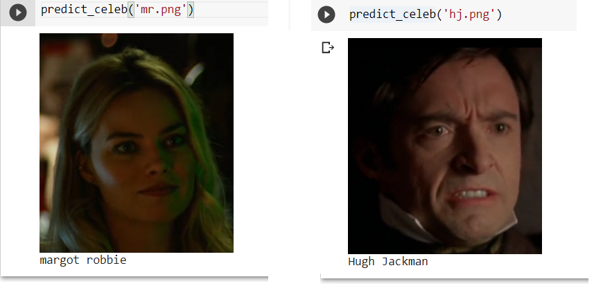

# Face Recognition using VGG-Face

This repository implements face recognition using the **VGG-Face** model to extract embeddings, followed by **PCA** (Principal Component Analysis) for dimensionality reduction, and **SVC** (Support Vector Classifier) for face classification.



---

## 📁 Dataset

- Custom dataset: [PIN's Face Recognition Dataset](https://www.kaggle.com/datasets/hereisburak/pins-face-recognition)
- The dataset contains images of celebrities used for training the model to recognize faces.


## 🔧 Requirements

- **keras_vggface** (for using the VGG-Face model)
- **OpenCV** (cv2)
- **scikit-learn** (for PCA and SVC)
- **numpy** (for numerical operations)


## ⚙️ Model Workflow

1. **VGG-Face Model**: The pre-trained VGG-Face model (using the `ResNet50` architecture) is used to generate face embeddings. These embeddings capture high-level features of the face.
2. **PCA (Principal Component Analysis)**: Dimensionality reduction is applied to the embeddings using PCA, making the subsequent classification step computationally efficient.
3. **SVC (Support Vector Classifier)**: A Support Vector Classifier with `decision_function_shape='ovo'` is trained on the PCA-reduced embeddings, classifying faces based on the celebrity labels in the dataset.


## 📌 How to Use

1. Clone the repository.
2. Download the dataset from [PIN's Face Recognition Dataset](https://www.kaggle.com/datasets/hereisburak/pins-face-recognition). To do it as per the notebook, place your `kaggle.json` file in the root of the repository and use the following commands (used in the notebook) to download the dataset via Kaggle API:

    ```bash
    mkdir -p ~/.kaggle
    cp kaggle.json ~/.kaggle
    chmod 600 ~/.kaggle/kaggle.json
    kaggle datasets download -d hereisburak/pins-face-recognition --unzip
    ```
4. Run the provided notebook to:
    - Use VGG-Face for face embedding extraction.
    - Apply PCA for dimensionality reduction.
    - Train the SVC model and perform face recognition.

This project demonstrates how to integrate deep learning models (VGG-Face) with classical machine learning techniques (PCA and SVC) for face recognition tasks.
